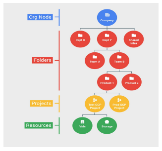

# Google Cloud Computing

## Google Cloud Ecosystem 

## What is Google cloud computing and it's [[services]]? 

It is used for both applications and for data.

**Who are the creators of cloud computing?**

The Cloud was created by US National Institute of Standard and Technology created it and nothing to do with GCP. 

### Five Traits of cloud computing? 

* On-demand self-service
* Broad Network Access 
* Resource pooling
* Rapid elasticity
* Measured Service
  
 ### What is unique about cloud computing?
  
  Few decades ago cloud computing started by some small IT companies by using **collocation** that is by renting spaces and sharing facalities instead of building big data centers. To be more efficient they use **Virtualization** in the later times what was user configures and provider managed and maintained. The virtual data center match the parts of the physical data center like server and disk. Even though it looks efficient but you still need to guess how much hardware is requires to keep and running the servers. 
  
  Google used the [[container based architecture model]] which is automated elastic Third Wave cloud built from [[automated services]]
  In Googles internal cloud services automatically provision configure the infastructure that is used to run familiar Google applications.
  
  [[The Google cloud platform resource hierarchy]]

  
  
  What ever you use inside the GCP is organised in projects. This projects are otrganised in to folders. ll the folders and projects inside the organisation can be brought under organization nodes. inside the organization node, folders and projects policies can be defined. 
  **POLICIES ARE INHERITED DOWNWARDS IN THE HIERARCHY**
  * All GCP services yiu use are associated with project. 
  * You can use services like managing API's , enabling billing abd other services. 
  * 
  
  #### Organisation node 
  
  This is the root of the company architecture.
  
## Identity and Acess Management 

persons-- **IAM lets administrators** and they can **authorize** who can take action on specific resources

IAM means Identity and Access Management and it **defines**

* Who: Can be gropup, service account or entire G suite
* can do what 
* on which resource

### Roles in cloud IAM 
1. Primitive
2. Predefined
3. Custom

**Primitive** role effect all resources in the project. 
put the screenshot here 

# interacting with GCP

1. cloud platform console (web user inerface)
2. cloud shell and cloud sdk (command line interface)
3. cloud console mobile app (For ios and Android)
4. Rest based API(for custom applictions)

[//begin]: # "Autogenerated link references for markdown compatibility"
[services]: services "Services"
[container based architecture model]: container-based-architecture-model "Container Based Architecture Model"
[automated services]: automated-services "Automated Services"
[//end]: # "Autogenerated link references"